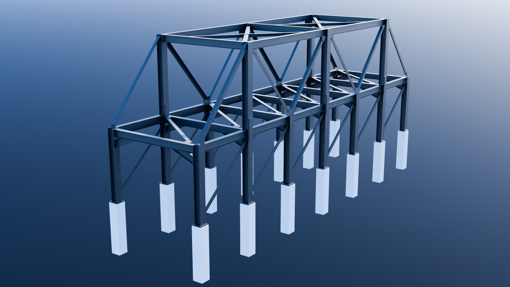

# Railway Steel Bridge – Advance Steel Project

## Overview

This project is a 3D model of a railway steel bridge developed using Autodesk Advance Steel.
It was created as a practical exercise to build competency in structural steel modeling, member layout, and connection detailing within a bridge context.

The model represents a simplified railway bridge structure composed of primary load-bearing members and supporting elements.

---

## Objectives

* Develop proficiency in Advance Steel for structural applications
* Model a bridge-type steel structure
* Understand member alignment and spatial coordination
* Apply and evaluate steel connections

---

## Tools & Technologies

* Autodesk Advance Steel
* AutoCAD (core platform)

---

## Model Description

The bridge model includes:

* Vertical steel columns/piers
* Longitudinal and transverse beams
* Top frame structure representing the bridge deck support system
* Connection elements at beam-column interfaces

The structure is modeled using parametric steel components and standard Advance Steel tools.

---

## Key Learnings

### 1. Structural Layout

Modeling a bridge requires careful alignment of members to maintain structural continuity and realistic load paths.

### 2. Parametric Modeling in Advance Steel

Advance Steel objects are intelligent and editable, which is useful for detailing but introduces complexity when exporting to other formats.

### 3. Connection Behavior

Connections (macros) simplify modeling but generate complex geometry that may not always translate cleanly into other formats.

---

## Output

* 3D DWG model
* STL file for visualization / external use

---

## Preview

## Future Improvements

* Add detailed bridge-specific components (deck system, bracing)
* Improve connection realism
* Generate fabrication and shop drawings

---

## Notes

This project focuses on foundational skills in steel modeling within a bridge context.

---
